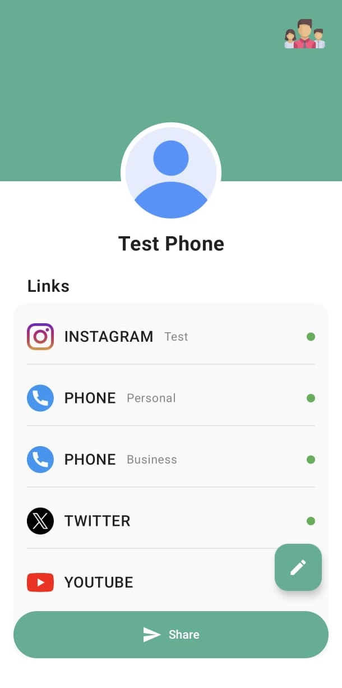
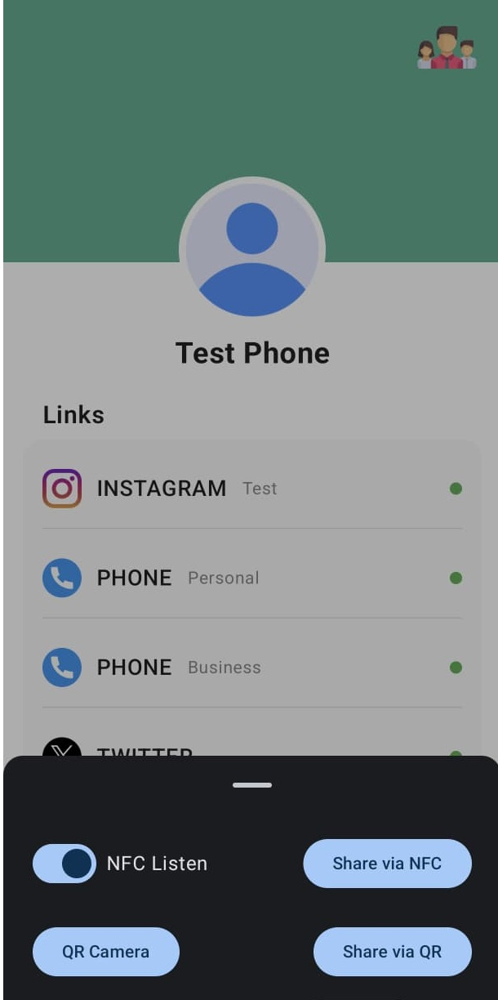
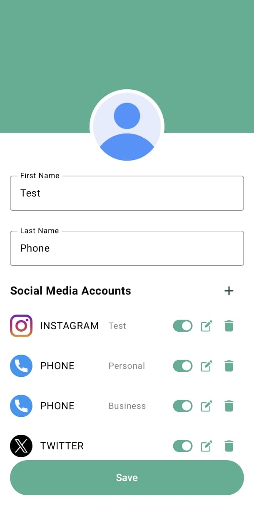
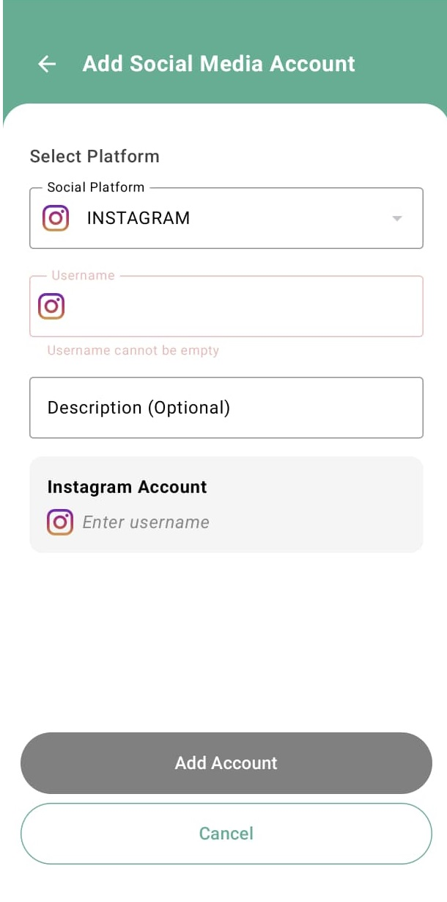
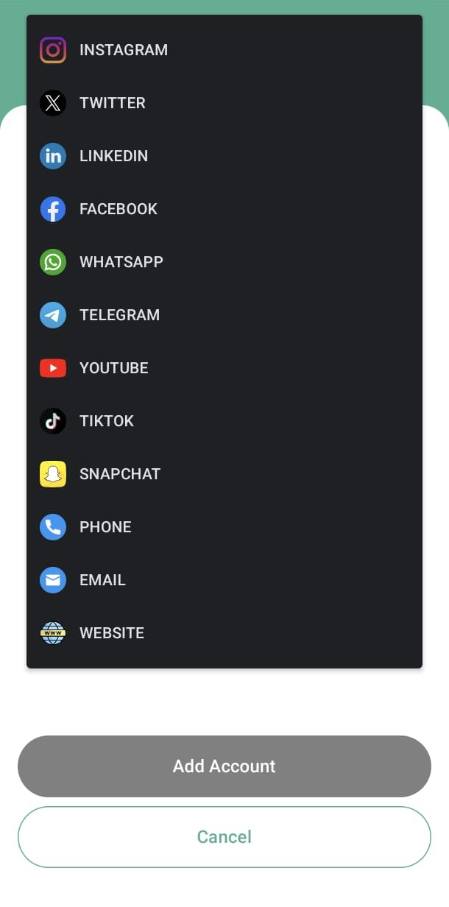
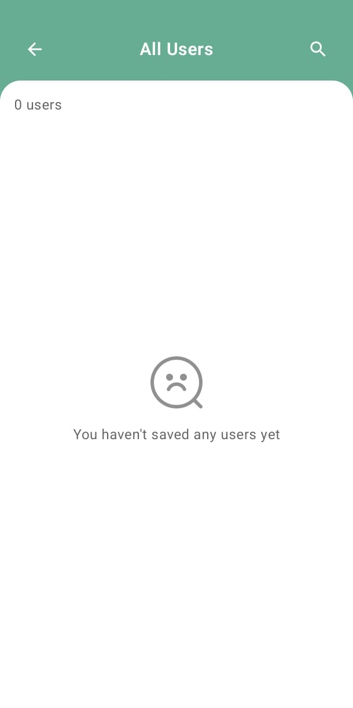

# SmartCard - Personal Info Sharing App

SmartCard is a modern Android application that allows two newly acquainted users to share selected contact details (name, profile photo, phone number, social media accounts, etc.) with each other via **NFC** or **QR code**.

## ✨ Features

- Save personal information once, share anytime
- Share via **NFC** or **QR Code**
- Choose which data to share
- Tap on shared data to open relevant apps (e.g., Instagram, WhatsApp)
- Shared data is stored locally and can be accessed or deleted later
- Modern and intuitive UI with **Jetpack Compose**


## 📸 Screenshots

<table border="0">
<tr>
  <td></td>
  <td></td>
  <td></td>
</tr>

><tr>
  <td></td>
  <td></td>
  <td></td>
</tr>
</table>

## 🛠️ Tech Stack

| Category | Technology |
|----------|------------|
| Language | Kotlin |
| Architecture | MVVM + Clean Architecture |
| Dependency Injection | Dagger Hilt |
| UI | Jetpack Compose |
| Local Storage | Room |
| Data Sharing | NFC, QR Code |

## 🧠 Project Structure

```
com.hulusimsek.smartcard
│   SmartCardApplication.kt
│
├───core
│   ├───extension
│   │       StringExtensions.kt
│   │
│   └───util
│           Constants.kt
│           ResourceProvider.kt
│           TimeUtils.kt
│
├───data
│   ├───local
│   │   │   AppDatabase.kt
│   │   │
│   │   ├───converter
│   │   │       SocialPlatformConverter.kt
│   │   │
│   │   ├───dao
│   │   │       SocialMediaAccountDao.kt
│   │   │       UserDao.kt
│   │   │
│   │   └───entity
│   │           SocialMediaAccountEntity.kt
│   │           UserEntity.kt
│   │
│   ├───mapper
│   │       ImageSourceMapper.kt
│   │       SocialMediaAccountMapper.kt
│   │       UserMapper.kt
│   │
│   ├───model
│   │       ExportedAccount.kt
│   │       ExportedUserData.kt
│   │
│   ├───provider
│   │       ActivityProviderImpl.kt
│   │
│   ├───remote
│   │       SocialMediaAccountDto.kt
│   │
│   ├───repository
│   │       IntentRepositoryImpl.kt
│   │       LocaleRepositoryImp.kt
│   │       NfcRepositoryImpl.kt
│   │       QrCodeRepositoryImpl.kt
│   │       SocialMediaRepositoryImpl.kt
│   │       UserRepositoryImpl.kt
│   │
│   ├───service
│   │       MyHostApduService.kt
│   │
│   └───utils
│           getRealPathFromUri.kt
│
├───di
│       AppModule.kt
│
├───domain
│   ├───exception
│   ├───model
│   │       Countries.kt
│   │       ImageSource.kt
│   │       NfcData.kt
│   │       NfcMode.kt
│   │       NfcStatus.kt
│   │       QrCodeData.kt
│   │       QrScanResult.kt
│   │       SocialMediaAccount.kt
│   │       SocialPlatform.kt
│   │       User.kt
│   │
│   ├───provider
│   │       ActivityProvider.kt
│   │
│   ├───repository
│   │       IntentRepository.kt
│   │       LocaleRepository.kt
│   │       NfcRepository.kt
│   │       QrCodeRepository.kt
│   │       SocialMediaRepository.kt
│   │       UserRepository.kt
│   │
│   ├───service
│   └───usecase
│       │   SocialMediaUseCases.kt
│       │   StorageUseCases.kt
│       │   UserUseCases.kt
│       │
│       ├───composite
│       │       JsonConverterUseCase.kt
│       │       ParsePhoneNumberUseCase.kt
│       │       UpdateUserAndAccountsUseCase.kt
│       │
│       ├───local
│       │       GetDeviceLocaleUseCase.kt
│       │
│       ├───nfc
│       │       DisableNfcAllUseCase.kt
│       │       EnableNfcListenerUseCase.kt
│       │       EnableNfcSenderUseCase.kt
│       │       IsNfcAvailableUseCase.kt
│       │       IsNfcEnabledUseCase.kt
│       │       ObserveNfcDataUseCase.kt
│       │       ResumeNfcAllUseCase.kt
│       │
│       ├───qrcode
│       │       ExtractQrDataUseCase.kt
│       │       GenerateQrCodeUseCase.kt
│       │
│       ├───social_media
│       │       DeleteAccountUseCase.kt
│       │       GetAccountByUserUseCase.kt
│       │       GetAccountStreamUseCase.kt
│       │       InsertAccountUseCase.kt
│       │       OpenSocialPlatformUseCase.kt
│       │       ToggleAccountActiveStatusUseCase.kt
│       │       UpdateAccountUseCase.kt
│       │
│       ├───storage
│       │       ClearTempProfileImagesUseCase.kt
│       │       CreateTempImageUriUseCase.kt
│       │       DeleteProfileImageUseCase.kt
│       │       SaveProfileImageUseCase.kt
│       │
│       └───user
│               DeleteUserUseCase.kt
│               GetAllUserStreamUseCase.kt
│               GetUserByIdUseCase.kt
│               GetUserStreamUseCase.kt
│               InsertUserUseCase.kt
│               UpdateUserUseCase.kt
│
└───presentation
    ├───all_user
    │   │   AllUsersScreen.kt
    │   │   AllUsersUiState.kt
    │   │   AllUsersViewModel.kt
    │   │
    │   └───components
    │           SearchBar.kt
    │           UserItem.kt
    │
    ├───common
    │   │   ResourceProviderImpl.kt
    │   │
    │   └───extensions
    │           ContextExtension.kt
    │           QrCodeDataExtension.kt
    │           SocialPlatformExtensions.kt
    │
    ├───edit
    │       EditableUserInfo.kt
    │       EditScreen.kt
    │       EditViewModel.kt
    │
    ├───friend
    │   │   FriendScreen.kt
    │   │   FriendUiState.kt
    │   │   FriendViewModel.kt
    │   │   UiEvent.kt
    │   │
    │   └───components
    │           ReceivedSocialMediaLink.kt
    │
    ├───home
    │   │   HomeScreen.kt
    │   │   HomeUiState.kt
    │   │   HomeViewModel.kt
    │   │   NfcUiEvent.kt
    │   │
    │   └───components
    │           NfcSharingDialog.kt
    │           QrCodeDialog.kt
    │           ShareOptionBottomSheet.kt
    │           SocialMediaLink.kt
    │
    ├───main
    │       MainActivity.kt
    │
    ├───qr
    │   │   CaptureActivityPortrait.kt
    │   │
    │   └───ui
    │       └───theme
    │               Color.kt
    │               Theme.kt
    │               Type.kt
    │
    ├───social_media_account
    │   │   AccountUiState.kt
    │   │   SocialMediaAccountScreen.kt
    │   │   SocialMediaAccountViewModel.kt
    │   │
    │   └───components
    │           CountryDropdown.kt
    │           CustomOutlinedTextField.kt
    │           SocialPlatformDropdown.kt
    │           ThreeThreeFourTransformation.kt
    │
    └───theme
            Color.kt
            Theme.kt
            Type.kt
```

## 🚀 Getting Started

1. Clone the repository:

```bash
git clone https://github.com/hulusimsek/smartcard.git
```

2. Open the project in **Android Studio**.

3. Make sure you have an Android device or emulator with NFC capability (for full functionality).

4. Build and run the project.

## 🧪 How It Works – Example Scenario

1. **User A** installs the app and fills in their contact information: name, profile picture, phone number, Instagram username, etc.
2. **User B** does the same on their own device.
3. Later, when they meet in person (e.g., at an event or meeting), they open the app and select the data they want to share.
4. **User A** chooses to share via **NFC** and brings their phone close to **User B**'s device.
5. **User B** receives the selected contact data immediately and can:
   - View it within the app
   - Tap on the Instagram handle to open it directly in the Instagram app
6. The shared information is saved in **User B**'s history and can be revisited or deleted later.

## 📌 Requirements

- Android Studio Flamingo or higher
- Android SDK 24+
- Gradle 8+
- NFC-supported Android device (for testing NFC)

## 🔐 Permissions Used

- `NFC`: Required for near-field communication
- `CAMERA`: Required for scanning QR codes
- `INTERNET`: For opening social media apps via deep links

## 📄 License

This project is licensed under the MIT License.  

---

Feel free to contribute or provide feedback!

Made with ❤️ by Hulusi Şimşek(https://www.linkedin.com/in/hulusimsek/)
